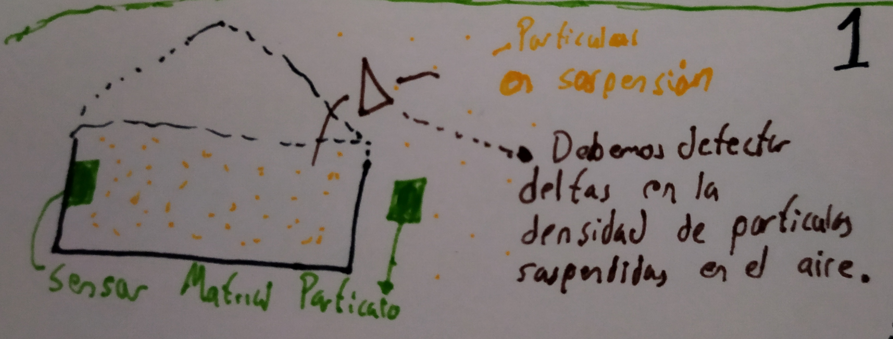

# Air_flow_indoor
En tiempos de COVID el interior es más peligroso que el exterior, existen distintos factores que influyen en la probabilidad de contagio, en la revista el [ElPais](https://elpais.com/ciencia/2020-10-24/un-salon-un-bar-y-una-clase-asi-contagia-el-coronavirus-en-el-aire.html) pueden revisar con más detalle, los factores que influyen se pueden resumir en:
- Uso de tapabocas
- Distanciamiento Social
- La intensidad con que las personas hablan
- Numero de personas en un área determinada
- Tiempo de exposición a aire contaminado
- Tasa a la cual el aire interno se cambia por aire externo ***(Que tan ventilado está el recinto)***

## Medición
Existe una metodología propuesta por hardvard para la reapertura de colegios, en esta se proponen varios métodos para la medición del Flujo de aire en interiores.

- Anemómetro ([Ver](https://www.sciencedirect.com/science/article/abs/pii/S0360132318305213?casa_token=KsvtDw9cMYgAAAAA:WS1uscTEO71o2ZbN11FPhRWO_GI4P0WMhXLTOfHahKWubnvBt2ErM6WoXMU8qAMUU0fvfrrSevx1))
- Método con monitor de CO2 ([Ver](https://medium.com/@jjose_19945/how-to-quantify-the-ventilation-rate-of-an-indoor-space-using-a-cheap-co2-monitor-4d8b6d4dab44))

*En este repositorio buscaremos descubrir como podemos medir esta tasa de cambio de aire en establecimientos "cerrados" como salones de clase a partir de las mediciones de Material particulado ya que la exposición prolongada a altos niveles de material particulado (PM10, PM2.5) puede estar relacionado con las muertes por COVID ([Ver](https://www.aljazeera.com/news/2020/10/27/new-study-links-air-pollution-15-percent-of-covid-19-deaths?utm_source=Nature+Briefing&utm_campaign=427b6f8c3c-briefing-dy-20201027&utm_medium=email&utm_term=0_c9dfd39373-427b6f8c3c-42004451) ) y en general por enfermedades cardio respiratorias ([Ver](https://www.eltiempo.com/vida/medio-ambiente/la-contaminacion-causa-siete-millones-de-muertes-en-el-mundo-437446#:~:text=De%20acuerdo%20con%20sus%20informes,muertes%20por%20c%C3%A1ncer%20de%20pulm%C3%B3n.)).*

En china ya han hecho acercamientos de esta idea [Ver](https://www.sciencedirect.com/science/article/abs/pii/S0360132318305134?casa_token=5upCUbqnnQIAAAAA:xpH1wx8Er7UcfX5xv5GUgkTpMckWAsesRub92xgonayjHrm5KZZxSct9Jg-m-zER9EIKOsaCb1GB).

### Asunciones
Partimos de 3 asunciones:
- El material particulado varia a lo largo del día, esto se debe a fenómenos contaminantes y el flujo natural de aire en exteriores.
-El material particulado varia en interiores debido principalmente a fuentes puntuales como cocinas, en menor medida por el flujo de aire que ocasionan la re-suspensión de partículas que estaban adheridas a superficies planas como paredes.
- El material particulado no varia en distancias cercanas (menores a 100mt)

Aprovechando estas tres asucniones nos planteamos la posibilidad de determinar el flujo de aire en interiores comparando los niveles de material particulado en el interior y exterior de un recinto "cerrado".

 

### Hipótesis

Tenemos 2 hipótesis que intentaremos responder.

- Si al interior de una habitación no existe flujo de aire, el nivel de PM10, PM2-5 o PM1 no cambiara.
- Los cambios en los niveles de PM10, PM2.5 y PM1 en exterior o interior tendrán una respuesta transitoria detectable en minutos, esto ocasionara deltas entre el exterior y el interior, el tiempo en el cual este delta se hace cero y/o la amplitud del delta y/o la velocidad con que cambia el material particulado en interior será proporcional a la velocidad con la cual el aire interno se cambia por aire externo.
